# Creating a Switch Controller with a Raspberry Pi Pico

This guide will show you how to transform a Raspberry Pi Pico into a custom game controller compatible with the Nintendo Switch using the open-source firmware **GP2040-CE**.

## Key Benefits

- **No programming required**
- **Supports multiple consoles** (although we’ll focus on the Switch)
- **Easy configuration** through a built-in website on the Pico:
  - Backup and restore configurations
  - Customize buttons, rotary encoders (knobs), and joysticks
  - Create macros (one button triggers multiple inputs)
  - Supports various optional add-ons
- **Quick setup** — can be done in under 30 minutes

---

## Bill of Materials (~€15)

| Item                          | Notes                                          | Price     |
| ----------------------------- | ---------------------------------------------- | --------- |
| **Raspberry Pi Pico (RP2040)** | Buy official; with headers if possible         | ~€7       |
| **Breakout board** (optional)  | Simplifies connections, highly recommended     | ~€5       |
| **Buttons**                    | Any buttons or micro switches                  | Varies    |
| **Wires, terminals**           | Various connections for buttons                | Varies    |

- [Raspberry Pi Pico - Amazon.de](https://www.amazon.de/-/en/SC0915-Raspberry-Pi-Pico/dp/B09KVB8LVR/)
- [Breakout board - Amazon.de](https://www.amazon.de/-/en/Expansion-Interface-Dual-Core-Processor-Compatible/dp/B0CPY6F9FF/)

---

## Steps Overview

### Hardware Setup: Wiring the Buttons
### Software Setup:
1. Download the GP2040-CE firmware.
2. Put the Pico into USB mode.
3. Flash the firmware.
4. Configure the device for Switch mode.
5. Test the controller.

---

## Wiring the Buttons

For this example, we’ll wire five buttons:

- **Right**
- **Left**
- **A**
- **B**
- **S2** (used to boot the Pico into configuration mode)

You can wire more buttons (e.g., Up, Down) similarly for your final design.

### Pins Overview

| Button         | Wire 1 | Wire 2 |
| -------------- | ------ | ------ |
| Right          | GND    | GP04   |
| Left           | GND    | GP05   |
| A (B1)         | GND    | GP06   |
| B (B2)         | GND    | GP07   |
| Special 2 (S2) | GND    | GP17   |

- The GND (ground) pin is flexible and can be shared across buttons.

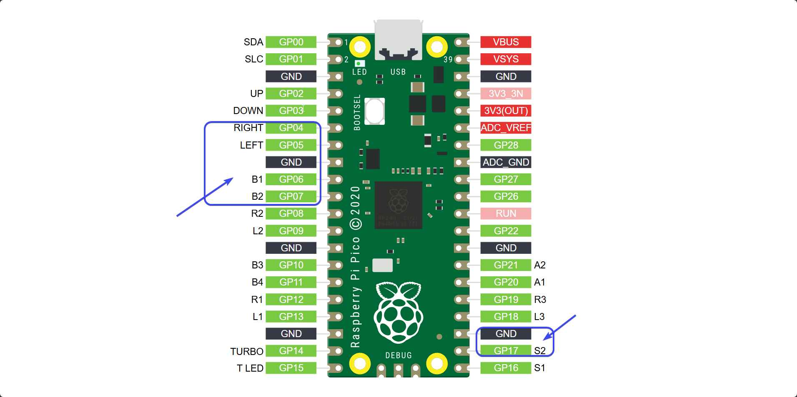

### Connecting the Wires

Simply connect the wires to the headers and screw them down.

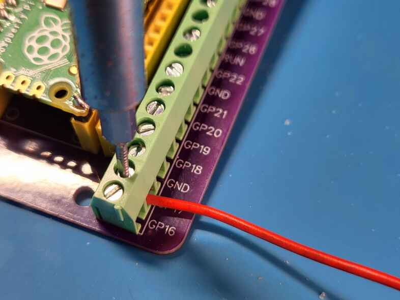

---

## Setting Up the Firmware

### 1) Download the Firmware

- Visit the [GP2040-CE downloads page](https://gp2040-ce.info/downloads).
- In the **Raspberry Pico** section, click **Download**.
- This will download a file like **GP2040-CE_X.X.X_Pico.uf2**.

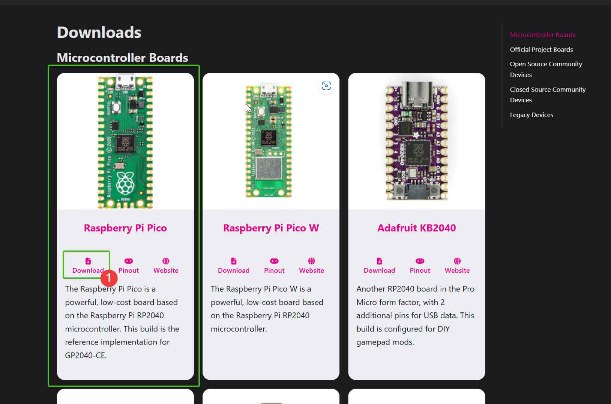

### 2) Enter USB Mode

- Find the **BootSel** button (near the USB port).
- **Unplug** the Pico.
- Open Windows Explorer.
- While holding the **BootSel** button, plug the Pico into the USB port.
- You should see a new removable drive named **RPI-RP2**.

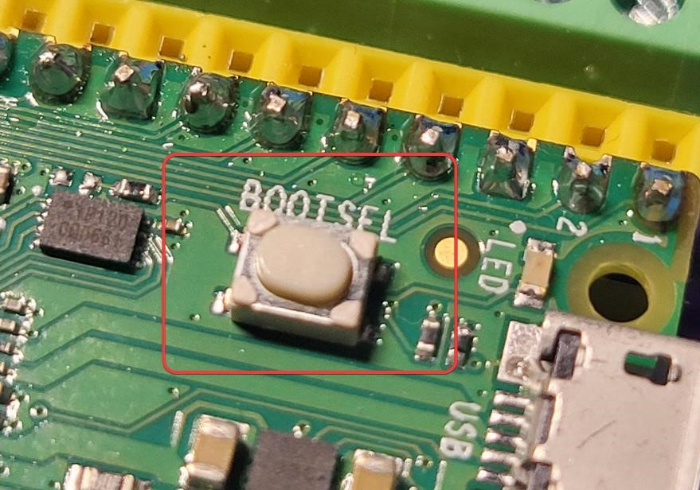

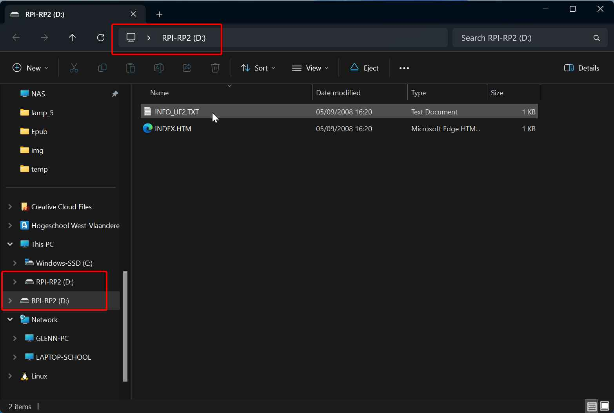

### 3) Flash the Firmware

- Drag and drop the **GP2040-CE_X.X.X_Pico.uf2** file into the **RPI-RP2** drive.
- The Pico will automatically disconnect and flash the firmware.

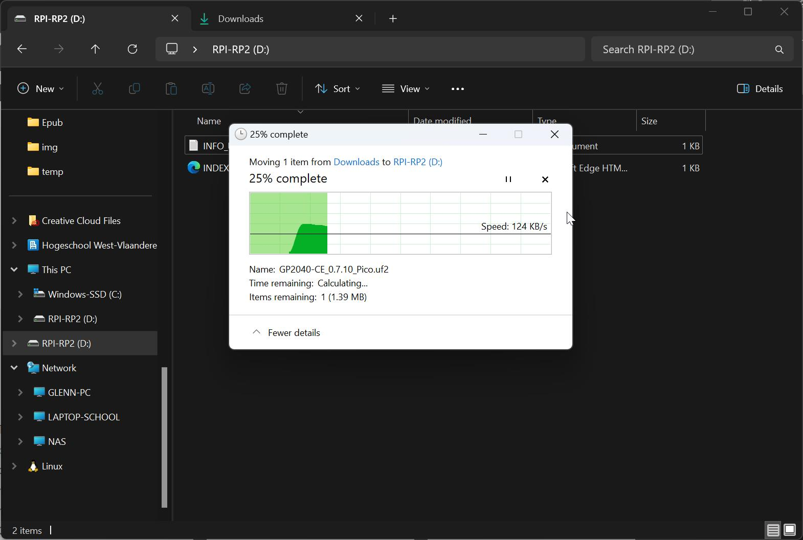

### 4) Enter Configuration Mode

- **Unplug** the device.
- **Hold the S2 button** and plug the Pico back into the USB port.
- Open your browser and navigate to [http://192.168.7.1](http://192.168.7.1).

### 5) Enable Switch Mode

1. Go to **Settings**.

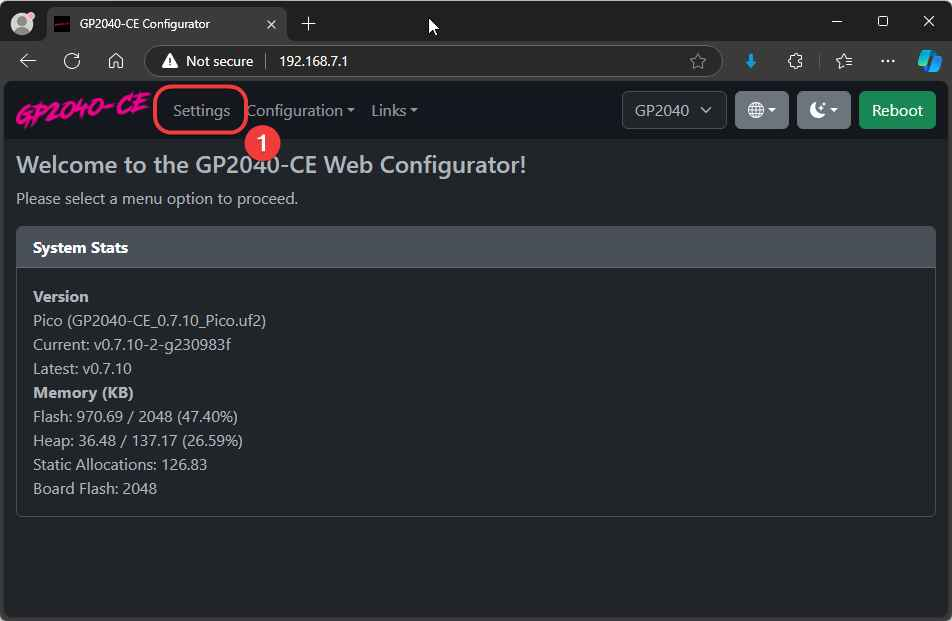

2. In the **Input Mode Settings**, set **Current Input Mode** to **Nintendo Switch**.

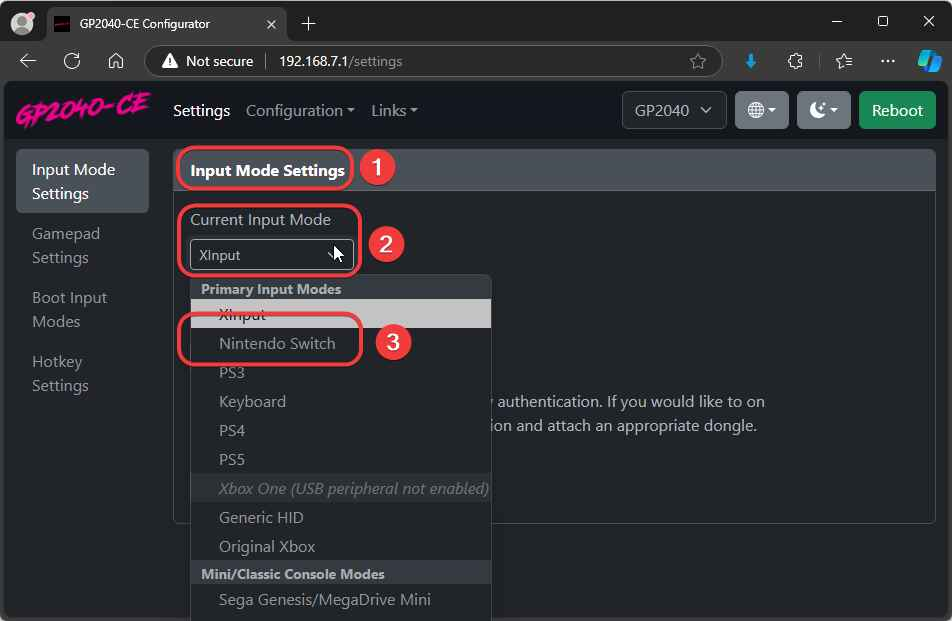

3. Press **Save**, and then click **Reboot**.

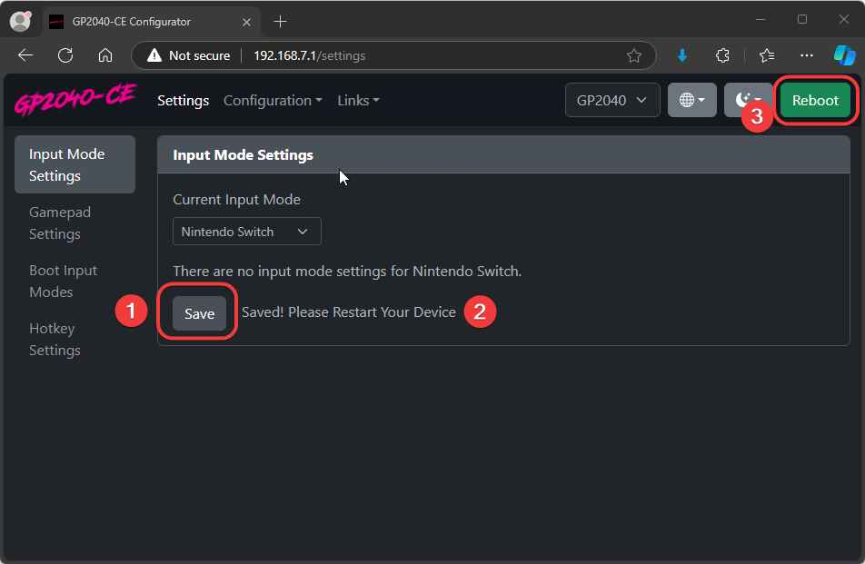

4. Click **Console** to test the configuration.

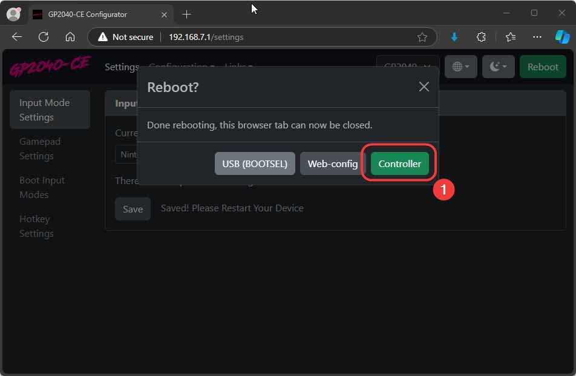

---

## Testing the Controller

1. Go to [https://hardwaretester.com/gamepad](https://hardwaretester.com/gamepad).
2. When you press a button, the controller should be recognized as **POKKEN CONTROLLER**.
3. Button presses (like A or directional inputs) will be reflected in real-time.

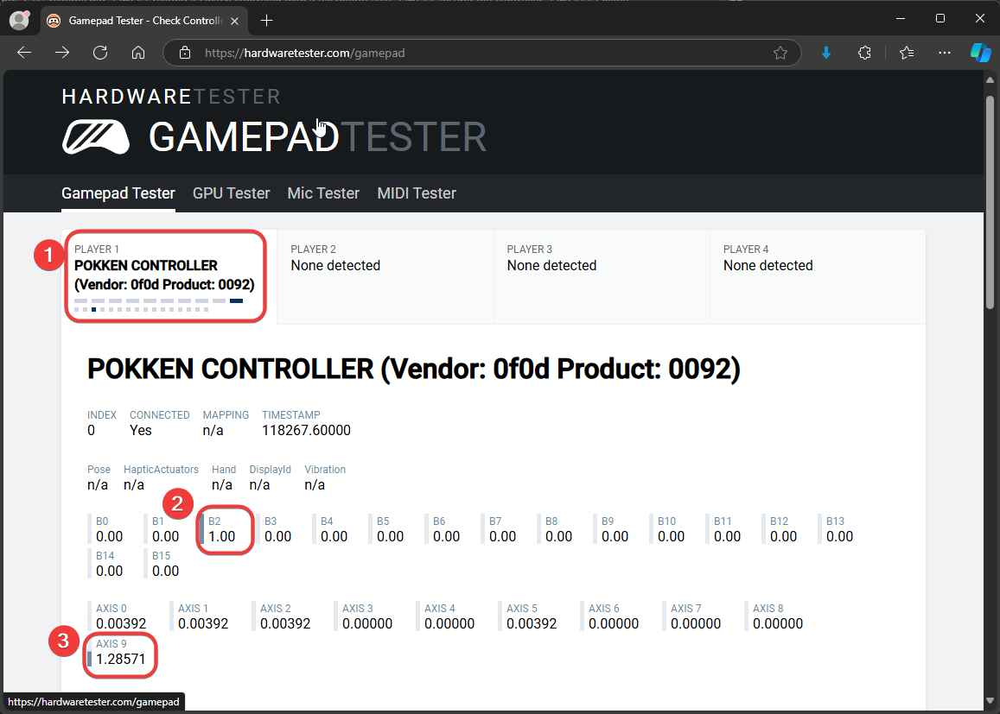

---

With this setup, you’ll have a fully functional Nintendo Switch controller that you can easily customize to fit your needs!

