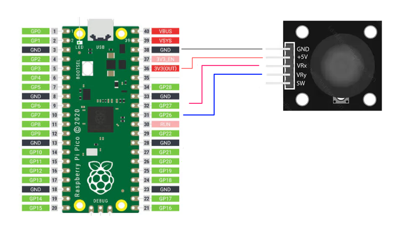

# Creating a Switch Controller with a Raspberry Pi Pico

This guide will show you how to transform a Raspberry Pi Pico into a custom game controller compatible with the Nintendo Switch using the open-source firmware **GP2040-CE**.

**Keep in mind the controller only works with Nintendo switch in docked mode!**

## Updates

### 13/11/2024

* Added example to use a joystick module

### 21/10/2024

* Initial release

## Video

  There is a step by step youtube video available at [https://www.youtube.com/watch?v=Jl17h7Sx4sw](https://www.youtube.com/watch?v=Jl17h7Sx4sw)

## Key Benefits

- **No programming required**
- **Supports multiple consoles** (although we’ll focus on the Switch)
- **Easy configuration** through a built-in website on the Pico:
  - Backup and restore configurations
  - Customize buttons, rotary encoders (knobs), and joysticks
  - Create macros (one button triggers multiple inputs)
  - Supports various optional add-ons
- **Quick setup** — can be done in under 30 minutes

---

## Bill of Materials (~€15)

| Item                          | Notes                                          | Price     |
| ----------------------------- | ---------------------------------------------- | --------- |
| **Raspberry Pi Pico (RP2040)** | Buy official; with headers if possible         | ~€7       |
| **Breakout board** (optional)  | Simplifies connections, highly recommended     | ~€5       |
| **Buttons**                    | Any buttons or micro switches                  | Varies    |
| **Wires, terminals**           | Various connections for buttons                | Varies    |

- [Raspberry Pi Pico - Amazon.de](https://www.amazon.de/-/en/SC0915-Raspberry-Pi-Pico/dp/B09KVB8LVR/)
- [Breakout board - Amazon.de](https://www.amazon.de/-/en/Expansion-Interface-Dual-Core-Processor-Compatible/dp/B0CPY6F9FF/)

---

## Steps Overview

### Hardware Setup: Wiring the Buttons
### Software Setup:
1. Download the GP2040-CE firmware.
2. Put the Pico into USB mode.
3. Flash the firmware.
4. Configure the device for Switch mode.
5. Test the controller.

---

## Wiring the Buttons

For this example, we’ll wire five buttons:

- **Right**
- **Left**
- **A**
- **B**
- **S2** (used to boot the Pico into configuration mode)

You can wire more buttons (e.g., Up, Down) similarly for your final design.

### Pins Overview

| Button         | Wire 1 | Wire 2 |
| -------------- | ------ | ------ |
| Right          | GND    | GP04   |
| Left           | GND    | GP05   |
| A (B1)         | GND    | GP06   |
| B (B2)         | GND    | GP07   |
| Special 2 (S2) | GND    | GP17   |

- The GND (ground) pin is flexible and can be shared across buttons.

### Connecting the Wires

Simply connect the wires to the headers and screw them down.

---

## Setting Up the Firmware

### 1) Download the Firmware

- Visit the [GP2040-CE downloads page](https://gp2040-ce.info/downloads).
- In the **Raspberry Pico** section, click **Download**.
- This will download a file like **GP2040-CE_X.X.X_Pico.uf2**.

### 2) Enter USB Mode

- Find the **BootSel** button (near the USB port).
- **Unplug** the Pico.
- Open Windows Explorer.
- While holding the **BootSel** button, plug the Pico into the USB port.
- You should see a new removable drive named **RPI-RP2**.

### 3) Flash the Firmware

- Drag and drop the **GP2040-CE_X.X.X_Pico.uf2** file into the **RPI-RP2** drive.
- The Pico will automatically disconnect and flash the firmware.

### 4) Enter Configuration Mode

- **Unplug** the device.
- **Hold the S2 button** and plug the Pico back into the USB port.
- Open your browser and navigate to [http://192.168.7.1](http://192.168.7.1).

### 5) Enable Switch Mode

1. Go to **Settings**.

2. In the **Input Mode Settings**, set **Current Input Mode** to **Nintendo Switch**.

3. Press **Save**, and then click **Reboot**.

4. Click **Console** to test the configuration.

---

## Testing the Controller

1. Go to [https://hardwaretester.com/gamepad](https://hardwaretester.com/gamepad).
2. When you press a button, the controller should be recognized as **POKKEN CONTROLLER**.
3. Button presses (like A or directional inputs) will be reflected in real-time.

---

With this setup, you’ll have a fully functional Nintendo Switch controller that you can easily customize to fit your needs!

---

## Joystick module

It is also possible to use PlayStation-style mini joystick controllers. This section explains how to add them.

An example of these kind of modules is seen below

{: width="50%"}

## Video

  There is a step by step youtube video available at [https://www.youtube.com/watch?v=DGvlZDRiA8w](https://www.youtube.com/watch?v=DGvlZDRiA8w)

## Wiring the Analog Joystick Axes

For this example, we’ll wire the analog axes of a PlayStation-style mini joystick:

- **X-Axis (Left/Right Movement)**
- **Y-Axis (Up/Down Movement)**

Both axes are analog, so they need to be connected to analog-capable pins on the microcontroller.

### Pins Overview

| Component         | Wire 1 | 
| ----------------- | ------ | 
| X-Axis (Left/Right) | 26   |
| Y-Axis (Up/Down)    | 27   |
| GND   | GND   |
| 5V    | 3V3    |

#### Notes:

- The PCB is marked for **5V**, but the **Pico** operates with a **3.3V** signal. Be sure to connect it to the **3.3V pin** to prevent any abnormal readings.  This is because the GPIO pins for the RP2040 utilize 3.3V logic and are not 5V-safe.

- The **X-Axis** and **Y-Axis** are **analog inputs** and should be connected to **analog-capable pins** (ADC pins), such as **GP26**, **GP27**, **GP28**, or **GP29**.

### Enter Configuration Mode

- **Unplug** the device.
- **Hold the S2 button** and plug the Pico back into the USB port.
- Open your browser and navigate to [http://192.168.7.1](http://192.168.7.1).

### Enable the Analog addon

1) Go to **Configuration** (1) menu
2) Select **Add-Ons configuration**

In the analog addons tab

1) **Enable** the addon
2) In **Analog Stick 1 X Pin** set the dropdown value to 26 (pin)
3) In **Analog Stick 1 Y Pin** set the dropdown value to 27 (pin)
4) Enable **Force circulation**
5) Enable **Autocalibration**
6) Enable **Analog smoothing**

Very important to save the changes, scroll down to the bottom and click the **Save** (1) button

Press **Save**, and then click **Reboot**.

Click **Console** to test the configuration.

---

### Problems

#### My joystick is inverted

You can invert the direction of the Joystick in the configuration menu by selecting the Axis you want to invert in the dropdown in the **Analog Stick 1 Invert** settings.

#### I want a second joystick

You can enable a second joystick by following the same connections as the first joystick, but use one of the other ADC pins, such as **GP28** or **GP29**.

Follow the same configuration steps as for Joystick 1, but make sure to configure the **Analog Stick 2** fields accordingly.

### Analog Joystick Settings

- **Invert Axis**: Choose if you want to flip the **X** or **Y** axis of **Analog Joystick 2** (or both).
- **Deadzone Size (%)**: Set the percentage for the **dead zone**. This is the area around the center where small movements won't be detected, preventing accidental input.
- **Forced Circularity**: Constrain the analog joysticks to move within a perfect circle. This can be useful for some games, but may cause issues in games that expect the sticks to move outside of the circle.
- **Auto Calibration**: Automatically re-centers the analog joysticks. It reads the joystick's center position when the device is powered on and adjusts accordingly to correct any drift until the next power cycle. This is useful for joysticks that experience drift over time.
- **Error rate**: You can change or experiment with the error rate to modify the accuracy if the default is not ok.

### 3D print alternative caps

You can easily use other caps than the PS2 controller for example here is a longer version

